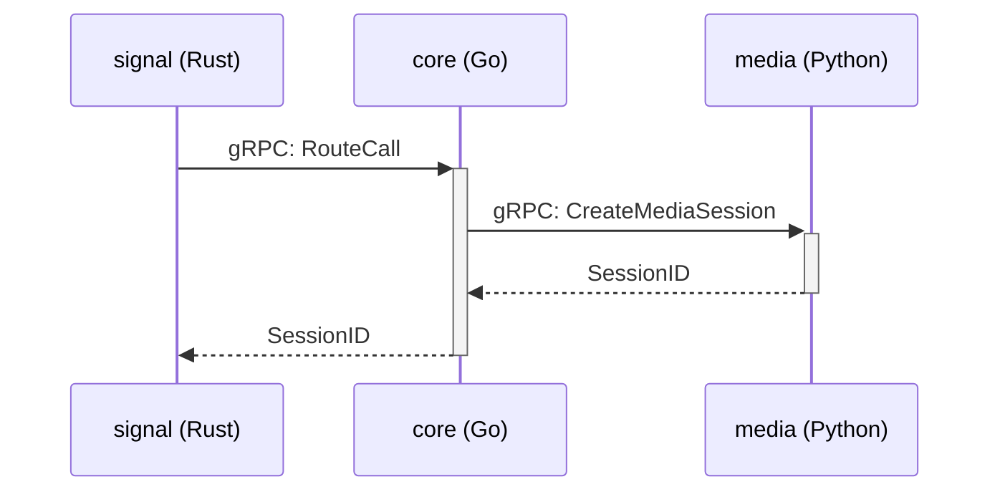

# Observability (İzlenebilirlik) Stratejisi

Platformun sağlığını, performansını ve hatalarını proaktif olarak tespit etmek için 3 temel prensibi (Metrics, Traces, Logs) benimsiyoruz.

### Monitoring Stack (İzleme Araçlarımız)

-   **Metrics (Prometheus & Grafana):** Sayısal performans verileri.
-   **Traces (Jaeger):** Bir isteğin servisler arasındaki yolculuğu.
-   **Logs (Loki):** Olay kayıtları.

### Servis Bazında İzlenecek Kritik Metrikler

| Servis | Kritik Metrik | Örnek | Amaç |
|:---|:---|:---|:---|
| **`signal`**| SIP Trafiği | `sip_requests_total{method="INVITE"}`| Gelen arama hacmini ve saldırıları tespit etme |
| **`core`** | gRPC Gecikmesi | `grpc_server_handling_seconds_bucket`| İş mantığı performansını ölçme |
| **`media`**| Ses Kalitesi (MOS)| `rtp_stream_mos_score` | Kullanıcı deneyimini ve ağ sorunlarını anlama |
| **`ai`** | Transkript Doğruluğu| `word_error_rate` (WER) | Yapay zeka modelinin kalitesini izleme |

### Örnek Bir İsteğin İzlenmesi (Tracing with Jaeger)

Jaeger, bu akıştaki her bir okun ne kadar sürdüğünü ve nerede darboğaz olduğunu bize gösterir.
