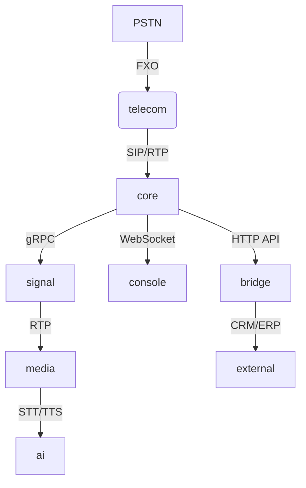
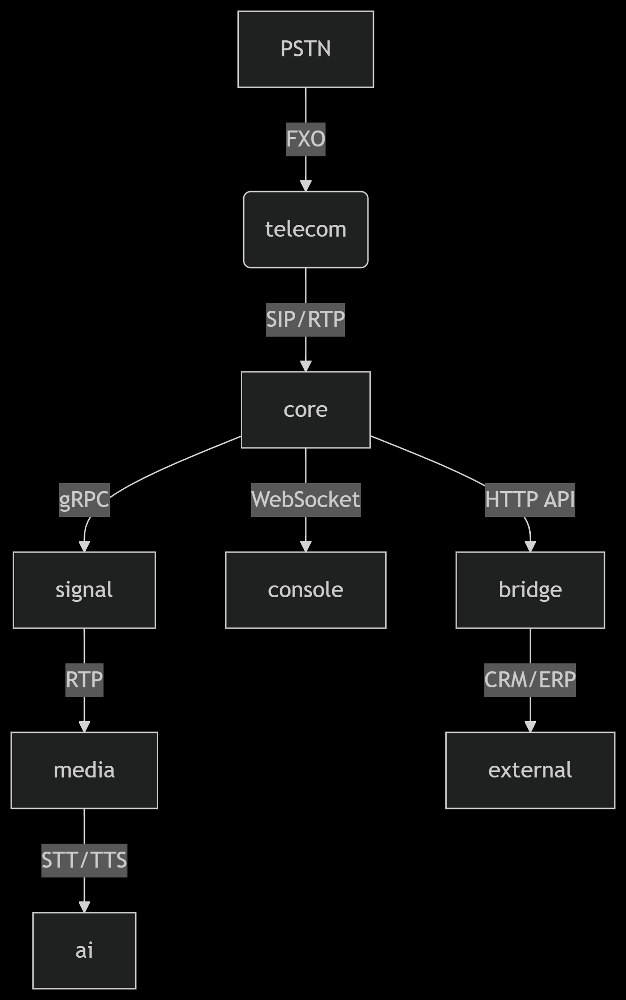

# governance
Proje yönetimi

Harika! **Centiric** organizasyonu altında tam kapsamlı bir VoIP platformu inşa edelim. İşte uçtan uca plan:

---

### **Mimari Diyagram (Temel Yapı)**


---

### **Repo Yapısı ve Görev Dağılımı**

| Repo | Açıklama | Teknoloji | Kritik Dosyalar |
|-------|----------|-----------|------------------|
| **[governance](https://github.com/Centiric/governance)** | Proje yönetimi | Markdown | `ROADMAP.md`, `ARCHITECTURE.md` |
| **[core](https://github.com/Centiric/core)** | Merkezi motor | Go | `call_router.go`, `auth_service.go` |
| **[signal](https://github.com/Centiric/signal)** | SIP/RTP stack | Rust | `sip_parser.rs`, `rtp_stream.rs` |
| **[media](https://github.com/Centiric/media)** | Ses işleme | Python+C | `codec_converter.cpp`, `webrtc_bridge.py` |
| **[telecom](https://github.com/Centiric/telecom)** | PSTN bağlantı | C++ | `fxo_driver.cpp`, `sip_gateway.cpp` |
| **[console](https://github.com/Centiric/console)** | Yönetim arayüzü | React+TS | `CallMonitor.tsx`, `AuthProvider.ts` |
| **[bridge](https://github.com/Centiric/bridge)** | Entegrasyonlar | Node.js | `crm_adapter.js`, `erp_connector.js` |
| **[ai](https://github.com/Centiric/ai)** | Ses analitiği | Python | `asr_engine.py`, `nlp_processor.py` |

---

### **3. Başlangıç Adımları**

#### **A. Governance Reposu Hazırlığı**
```bash
# Repo oluştur
gh repo create Centiric/governance --public --add-readme

# Temel dokümanlar
echo "# Centiric VoIP Platformu\n\n## Mimari\n" > ARCHITECTURE.md
mkdir -p diagrams && curl -o diagrams/architecture.png https://example.com/voip-arch.png
```

#### **B. Core Repo Kurulumu**
```go
// core/go.mod
module github.com/Centiric/core

go 1.21

require (
    github.com/pion/webrtc/v3 v3.2.0
    google.golang.org/grpc v1.58.0
)
```

#### **C. Signal Reposu İlk Commit**
```rust
// signal/Cargo.toml
[package]
name = "signal"
version = "0.1.0"

[dependencies]
tokio = { version = "1.0", features = ["full"] }
sip-core = "0.5.2"
```

---

### **4. Temel Özelliklerin Implementasyon Planı**

#### **Hafta 1: Çekirdek Altyapı**
1. `core`'da gRPC servisleri (`callrouter.proto`)
2. `signal`'da temel SIP parser
3. `governance`'a API spesifikasyonları eklenecek

#### **Hafta 2: Medya Akışı**
1. `media`'da G.711 → Opus dönüşümü
2. `telecom`'da FXO kart sürücüsü

#### **Hafta 3: Entegrasyonlar**
1. `bridge`'de Zoho CRM entegrasyonu
2. `console`'da gerçek zamanlı çağrı monitörü

---

### **5. Geliştirici Ortamı Kurulumu**
```bash
# Tüm repoları klonla
for repo in governance core signal media telecom console bridge ai; do
  git clone git@github.com:Centiric/${repo}.git
done

# Docker ortamını ayağa kaldır
docker-compose -f core/dev/docker-compose.yaml up -d
```

---

### **6. CI/CD Pipeline Örneği**
```yaml
# .github/workflows/core-ci.yml
name: Core CI
on: [push]
jobs:
  test:
    runs-on: ubuntu-latest
    steps:
      - uses: actions/checkout@v4
      - run: make test
      - uses: codecov/codecov-action@v3
```

---

### **7. Dokümantasyon Stratejisi**
- **Teknik Spec'ler**: Her repo'da `/docs` altında
- **API Dokümantasyonu**: Swagger UI ile `core` repo'da
- **Kullanıcı Kılavuzu**: `console` repo'da `USERGUIDE.md`

---

### **8. Test Ortamı Kurulumu**
```bash
# Örnek test araması yapma
curl -X POST http://localhost:8080/call \
  -H "Content-Type: application/json" \
  -d '{"from":"905551234567","to":"902123456789"}'
```

---

### **Neden Bu Yapı?**
1. **Modülerlik**: Her bileşen bağımsız geliştirilebilir
2. **Ölçeklenebilirlik**: Microservis mimarisi
3. **Yerel Destek**: Türkiye PSTN gereksinimlerine uyum
4. **Entegrasyon Hazır**: CRM/ERP bağlantıları için hazır katman

**Hemen Başlayalım!** Hangi repo'dan başlamamı istersiniz? İlk olarak:
1. `governance` repo'sunu dokümanlarla dolduralım, veya
2. `core` repo'da gRPC servislerini kodlayalım
