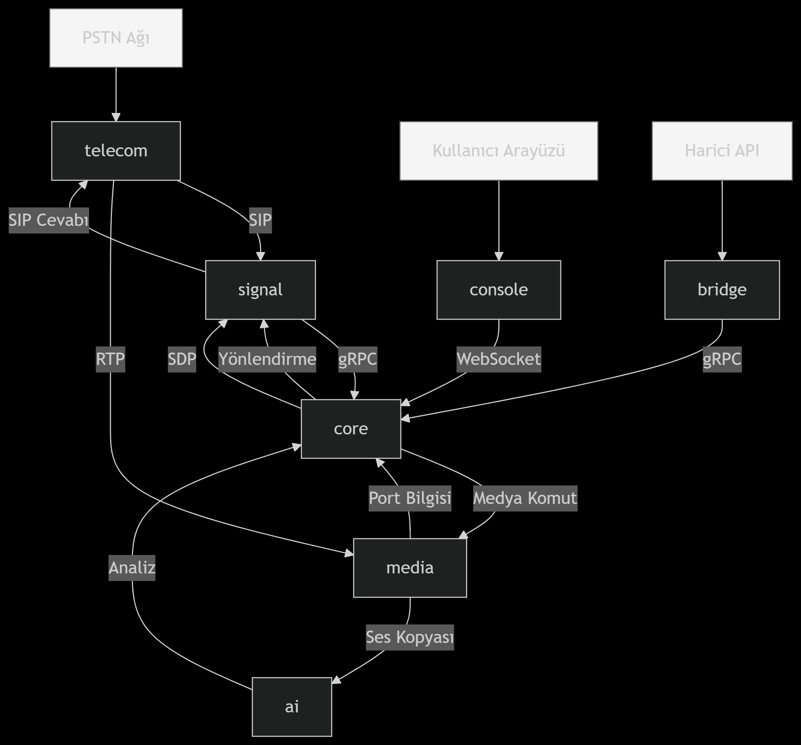

# Centiric Projesi Yönetimi

**Centiric**, modern, ölçeklenebilir ve bulut-uyumlu (cloud-native) bir VoIP iletişim platformudur. Bu repo, projenin mimari vizyonunu, yol haritasını, teknoloji kararlarını ve geliştirme standartlarını barındıran merkezi yönetim alanıdır.

---

### 🚀 **Vizyonumuz**

Her ölçekten işletme için; PSTN, WebRTC ve mobil entegrasyonlarını bir araya getiren, yapay zeka ile zenginleştirilmiş, güvenilir ve esnek bir iletişim altyapısı sunmak.

---

### 🏗️ **Nihai Mimari ve Karar Kayıtları**

Projemiz, her biri belirli bir sorumluluğu yerine getiren mikroservislerden oluşur. Bu yapı, bize maksimum esneklik, güvenlik ve ölçeklenebilirlik sağlar.

-   **[Mimari Detayları (ARCHITECTURE.md)](ARCHITECTURE.md):** Servislerin yapısını ve aralarındaki veri akışını detaylı olarak inceleyin.
-   **[Mimari Karar Kayıtları (ADRs)](ADRs/):** "Neden Rust seçildi?" gibi önemli teknik kararlarımızın gerekçelerini okuyun.

---

### 📚 **Repo Yapısı ve Teknoloji Seçimleri**

| Repo | Sorumluluk | Teknoloji | Durum |
| :--- | :--- | :--- | :--- |
| 🛡️ **[signal]** | SIP/RTP Sinyal Kalkanı (Edge) | `Rust` | Geliştiriliyor |
| 🧠 **[core]** | Merkezi Motor ve İş Mantığı | `Go` | Geliştiriliyor |
| 🎙️ **[media]** | Ses İşleme ve Medya Akışı | `Python/C` | Planlanıyor |
| 🤖 **[ai]** | Ses Analitiği ve Yapay Zeka | `Python` | Planlanıyor |
| ☎️ **[telecom]** | PSTN (Sabit Hat) Bağlantısı | `C++` | Planlanıyor |
| 💻 **[console]** | Yönetim Paneli Arayüzü | `React+TS` | Planlanıyor |
| 🔌 **[bridge]** | Harici Entegrasyonlar (API) | `Node.js` | Planlanıyor |
| 📜 **[governance]**| Proje Yönetimi ve Dokümantasyon | `Markdown` | Aktif |

---

### 📊 **Observability (İzlenebilirlik) ve Güvenlik**

Platformumuzun sağlığını ve güvenliğini en üst düzeyde tutmak için kapsamlı bir izleme ve güvenlik stratejisi uyguluyoruz.

-   **[Güvenlik Prensipleri (SECURITY.md)](SECURITY.md):** Her katmanda aldığımız güvenlik önlemlerini öğrenin.
-   **[İzleme Stratejisi (OBSERVABILITY.md)](OBSERVABILITY.md):** Prometheus, Jaeger ve diğer araçlarla sistemi nasıl izlediğimizi görün.

---

### 🗺️ **Yol Haritası ve Katkı**

-   **[Yol Haritası (ROADMAP.md)](ROADMAP.md):** Projenin gelecek hedeflerini ve zaman çizelgesini takip edin.
-   **[Geliştirme Rehberi (DEVELOPMENT_GUIDE.md)](DEVELOPMENT_GUIDE.md):** Projeye katkıda bulunmak için gerekli standartları ve süreçleri öğrenin.
