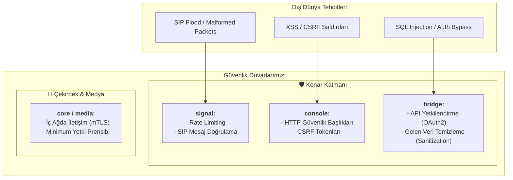

# Güvenlik Prensipleri

Centiric platformunun her katmanı, belirli tehdit vektörlerine karşı tasarlanmış güvenlik önlemleri içerir.

### Katman Bazlı Güvenlik Önlemleri

| Katman | Servis | Birincil Tehdit | Önlem |
|:---|:---|:---|:---|
| **Kenar** | `signal` | DDoS, SIP Flood, Geçersiz Paketler | **Rate Limiting**, SIP Başlık/Gövde Doğrulaması |
| | `bridge` | Yetkisiz API Erişimi, Enjeksiyon | **OAuth 2.0**, Gelen Veri Doğrulama ve Temizleme |
| | `console`| XSS, CSRF | **Content-Security-Policy**, Anti-CSRF Tokenları |
| **Çekirdek** | `core` | Yetkisiz İç Servis Erişimi | **mTLS ile servisler arası şifreleme**, RBAC (Rol Bazlı Erişim Kontrolü) |
| **Medya**| `media` | RTP Flood, Ses Manipülasyonu | **SRTP ile ses şifreleme**, Kaynak IP Doğrulaması |

### Fiziksel Güvenlik (`telecom` servisi)
- `telecom` servisini barındıran sunucular, kilitli ve erişimi kısıtlanmış sunucu odalarında bulunmalıdır.
- Fiziksel PSTN kartlarına yetkisiz erişim engellenmelidir.
