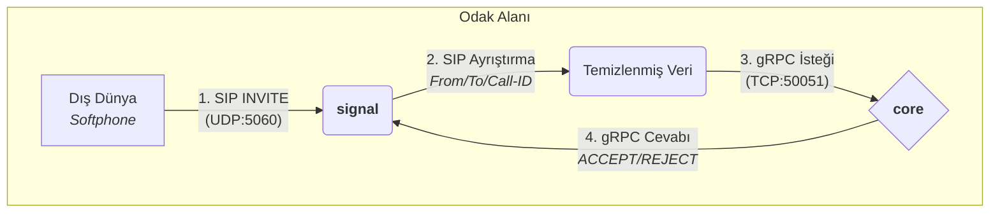

# Sprint Planı: MVP Çekirdek Altyapısı

- **Amaç:** Temel SIP/UDP akışını uçtan uca çalışır hale getirmek.
- **Süre:** 2 Hafta
- **Hedef Çıktı:** Dışarıdan gelen bir SIP `INVITE` mesajını yakalayıp, `core`'da işleyip, `media`'da teorik bir ses oturumu başlatabilmek.

---

### **Aşama 1: Sinyal Yakalama ve Yönlendirme (Sprint 1. Hafta)**

**Hedef:** `signal` -> `core` iletişimini tamamlamak.

