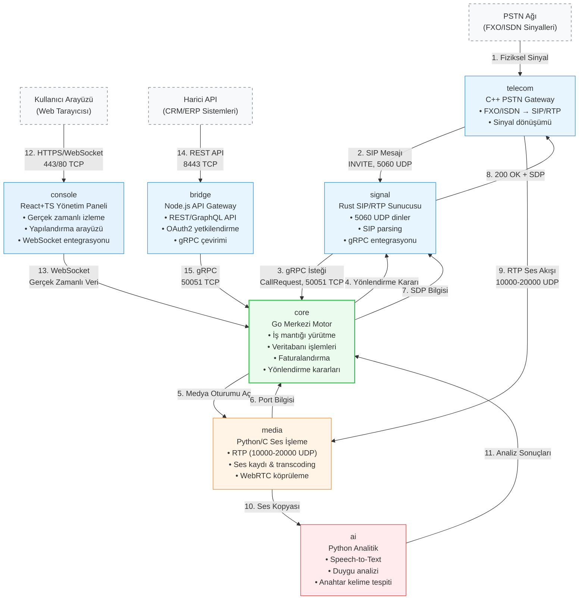
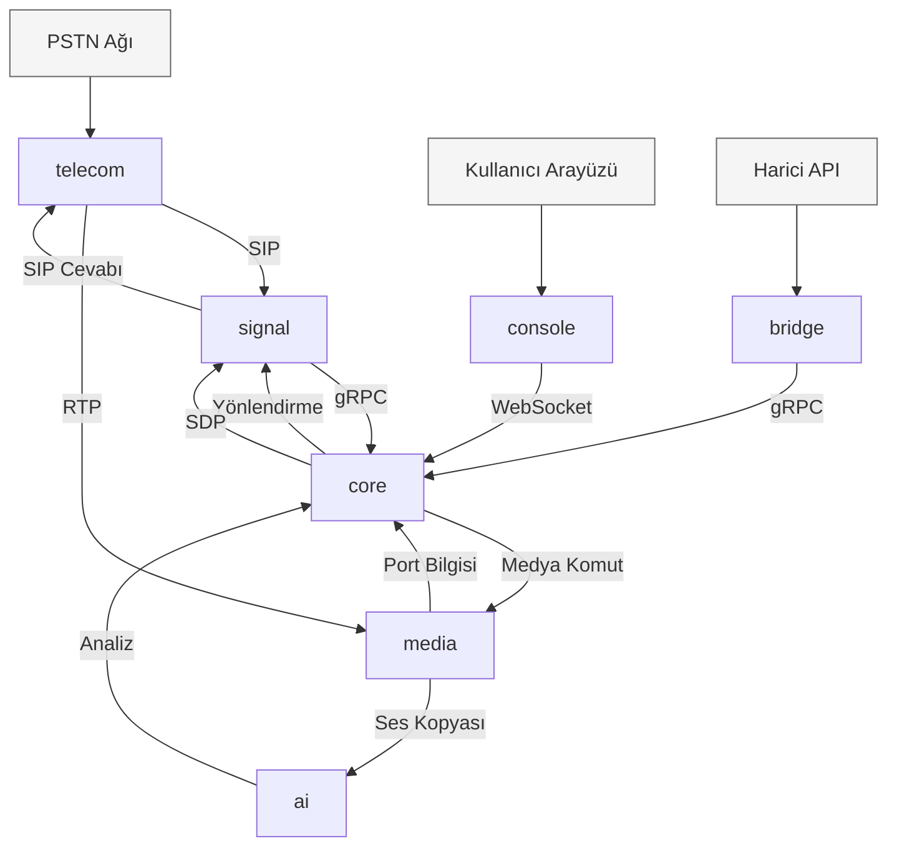

# Centiric - Nihai Sistem Mimarisi

Bu doküman, Centiric platformunu oluşturan tüm servislerin mimari yapısını, sorumluluklarını ve aralarındaki veri akışını detaylandırmaktadır.

---

### **Mimari Diyagram**

Aşağıdaki diyagram, servislerin katmanlı yapısını ve aralarındaki temel iletişim akışlarını göstermektedir.

---
Basit gösterim

---

### Akış Numaraları ve Protokol Tablosu:
| Akış | Kaynak | Hedef | Protokol | Port | Açıklama |
|------|--------|-------|----------|------|----------|
| 1 | PSTN | telecom | FXO/ISDN | - | Fiziksel sinyal |
| 2 | telecom | signal | SIP | 5060 | Çağrı başlatma |
| 3 | signal | core | gRPC | 50051 | Yönlendirme isteği |
| 4 | core | signal | gRPC | 50051 | Yönlendirme kararı |
| 5 | core | media | gRPC | 50051 | Medya oturum aç |
| 6 | media | core | gRPC | 50051 | Port bilgisi |
| 7 | core | signal | gRPC | 50051 | SDP bilgisi |
| 8 | signal | telecom | SIP | 5060 | Onay mesajı |
| 9 | telecom | media | RTP | 10000-20000 | Ses akışı |
| 10 | media | ai | gRPC | 50051 | Ses kopyası |
| 11 | ai | core | gRPC | 50051 | Analiz sonuçları |
| 12 | Kullanıcı | console | HTTPS | 443 | Arayüz bağlantısı |
| 13 | console | core | WebSocket | 80/443 | Gerçek zamanlı veri |
| 14 | Harici API | bridge | REST | 8443 | Entegrasyon |
| 15 | bridge | core | gRPC | 50051 | İç iletişim |

