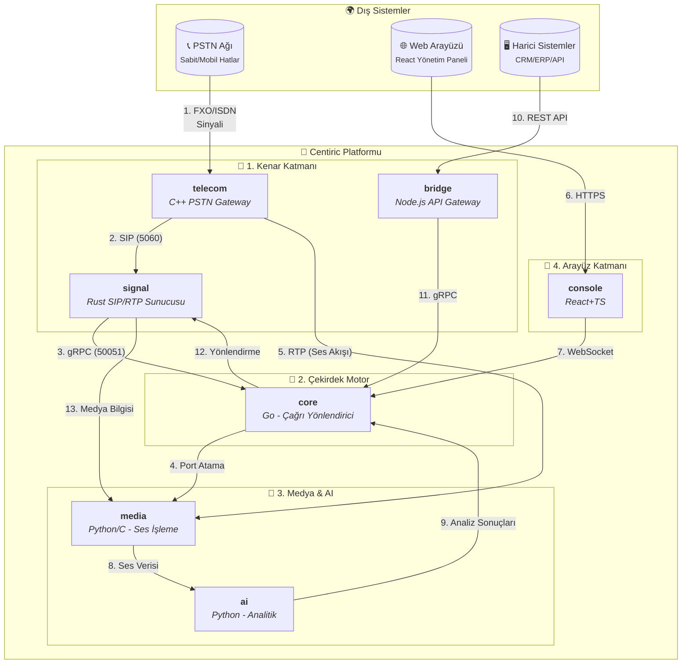

### **Centiric - Nihai Sistem Mimarisi**

---

### Mimarinin Açıklaması (Çağrı Akışı Üzerinden)

Bir müşterinin sizi sabit hattan aradığını düşünelim:

1.  **Gelen Sinyal (A -> D):** Arama, Türk Telekom santralinden sizin ofisinizdeki veya veri merkezinizdeki fiziksel telefon hattına (PSTN) gelir. **`telecom`** servisi, bu analog veya dijital (ISDN) sinyali algılayan donanım ve sürücüdür.

2.  **VoIP'ye Çeviri (D -> E):** **`telecom`**, bu eski tip sinyali alıp modern internet protokolü olan **SIP**'e çevirir ve bunu ağdaki **`signal`** servisine gönderir.

3.  **Sinyal Karşılama (E):** **`signal`** (Rust ile yazdığımız servis), `5060` portunda bu SIP `INVITE` paketini yakalar. Bu onun tek görevidir: SIP konuşmak.

4.  **"Ne Yapayım?" diye Sorma (E -> G):** **`signal`**, gelen SIP mesajını parçalara ayırır (kim arıyor, kimi arıyor), bu bilgiyi temiz bir **gRPC** isteğine dönüştürür ve projenin beyni olan **`core`** servisine sorar.

5.  **Karar Verme (G):** **`core`** (Go ile yazdığımız servis), veritabanına veya konfigürasyon dosyalarına bakarak bir karar verir. Örneğin: "Bu arama Satış Departmanına ait, sıraya al." veya "Bu numara engelli, meşgule düşür."

6.  **Medya Hazırlığı (G -> H -> E):** **`core`**, **`media`** servisine "Bir ses kanalı hazırla" komutu verir. **`media`** servisi, RTP (ses paketleri) için boş bir port (örneğin 12010) ayarlar ve bu bilgiyi `core` üzerinden `signal`'a bildirir.

7.  **Arayana Cevap (E -> A):** **`signal`**, `core`'dan gelen "aramayı kabul et" kararı ve `media`'dan gelen "sesi 12010 portuna gönder" bilgisiyle birlikte, arayan tarafa bir **`200 OK`** SIP cevabı gönderir. Bu cevap, sesin hangi IP ve porta gönderileceğini de içerir (SDP).

8.  **Konuşma Başlar (D <-> H):** Artık arayan taraf, sesini doğrudan **`telecom`** gateway'i üzerinden **`media`** servisinin ayırdığı porta (12010) RTP paketleri olarak göndermeye başlar. **`media`** servisi bu ses paketlerini alır, işler (gerekirse codec değiştirir, kaydeder) ve karşı tarafa iletir.

9.  **Yapay Zeka (H -> I -> G):** Konuşma sırasında, **`media`** servisi ses akışının bir kopyasını **`ai`** servisine gönderir. **`ai`** servisi bunu metne çevirir (transkript), duygu analizi yapar ve sonuçları `core`'a bildirir. `core` da bu veriyi veritabanına veya **`console`**'a (yönetim paneli) gönderir.

Bu yapı, her servisin sadece bir işi en iyi şekilde yaptığı, son derece modüler, ölçeklenebilir ve sağlam bir sistemdir. DeepSeek'in ilk vizyonuyla tamamen uyumludur, sadece servisler arası okları daha net ve mantıklı bir hale getirilmiştir.
