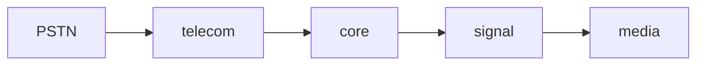

# Centiric VoIP Mimarisi

## Çekirdek Bileşenler

## Protokol Seçimleri
| Bileşen      | Protokol    | Gerekçe                     |
|--------------|-------------|----------------------------|
| Signal       | SIP over UDP| Düşük gecikme              |
| Core         | gRPC        | Yüksek performans          |
| Console      | WebSocket   | Gerçek zamanlı veri        |
